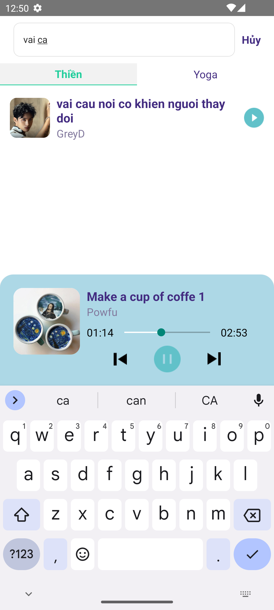
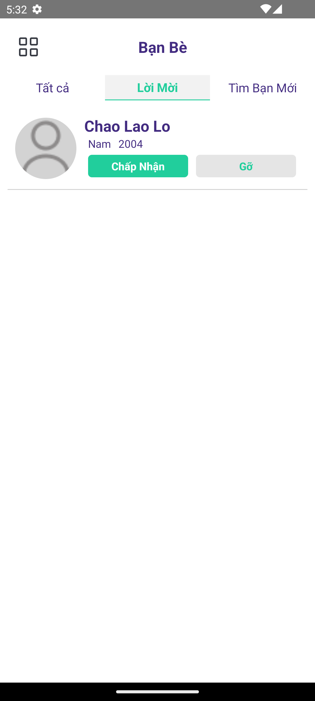
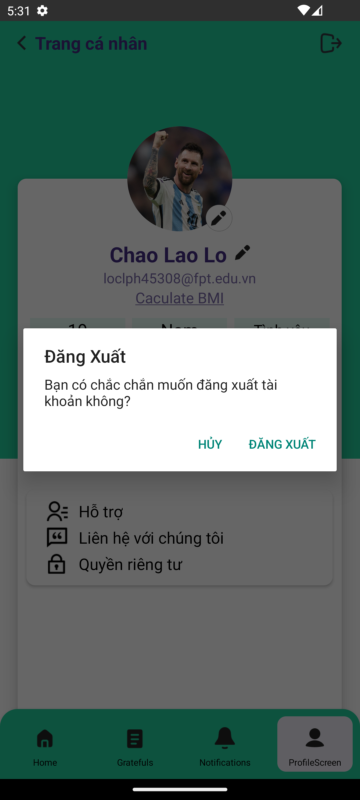

 
# NES_Care

**NES_Care** là một ứng dụng hỗ trợ quản lý chăm sóc sức khỏe và tư vấn, được phát triển bằng React Native cho nền tảng di động và sử dụng Firebase làm backend để lưu trữ và quản lý dữ liệu người dùng, bao gồm thông tin về các phiên tư vấn, tình trạng sức khỏe, v.v.

### Tính năng chính
- Đăng nhập và đăng ký qua Firebase Authentication.
- Quản lý hồ sơ người dùng với thông tin sức khỏe và mục tiêu.
- Xem danh sách và tìm kiếm các chuyên gia tư vấn.
- Tính BMI và đưa ra gợi ý thực đơn và các bài tập
- Gửi và nhận các tin nhắn giữa người dùng và chuyên gia.
- Theo dõi tiến trình sức khỏe, bao gồm bước đi, calo, và thời gian di chuyển.
- Xem video hướng dẫn, nghe nhạc để thiền hoặc yoga.
- Viết lời biết ơn, bao dung
- Kết bạn với người quen

## Công nghệ sử dụng
- **React Native**: Framework phát triển ứng dụng di động.
- **Ngôn ngữ**: JavaScript, TypeScript, định kiểu với HTML và CSS
- **Firebase**: Backend cho ứng dụng, sử dụng Firebase Authentication để đăng nhập người dùng, Firestore để lưu trữ dữ liệu.
- **Firebase Firestore**: Cơ sở dữ liệu NoSQL lưu trữ thông tin người dùng, tư vấn, bước đi, calo, video hướng dẫn, v.v.
- **React Navigation**: Điều hướng giữa các màn hình trong ứng dụng.

## Cài đặt
### 1. Cài đặt môi trường
Trước khi bắt đầu, bạn cần cài đặt các công cụ sau:
- [Node.js](https://nodejs.org/) (>=14.0)
- [React Native CLI](https://reactnative.dev/docs/environment-setup)
- [Android Studio](https://developer.android.com/studio) (cho Android) hoặc [Xcode](https://developer.apple.com/xcode/) (cho iOS)

### 2. Cài đặt phụ thuộc
Clone repository này về máy:
```bash
git clone https://github.com/chaolaolo/NES_Care.git
cd NES_Care
```
Cài đặt các phụ thuộc:
```bash
npm install
```
### 3. Cấu hình Firebase
Để cấu hình Firebase cho dự án, bạn cần tạo một dự án trên [Firebase Console](https://console.firebase.google.com/).
- Tạo một ứng dụng Firebase và lấy thông tin cấu hình.
- Thêm cấu hình Firebase vào ứng dụng bằng cách tạo file `firebaseConfig.js` trong thư mục `src/config/` và nhập thông tin cấu hình Firebase từ Firebase Console.
### 4. Chạy ứng dụng
Để chạy ứng dụng trên Android hoặc iOS, bạn có thể sử dụng các lệnh sau:
- Chạy trên Android:
```bash
npx react-native run-android
```
- Chạy trên iOS:
```bash
npx react-native run-ios
```
## Cấu trúc dự án
```
NES_Care/
├── android/               # Mã nguồn Android
├── ios/                   # Mã nguồn iOS
├── sources-code/           # Mã nguồn chính
│   ├── components/        # Các component UI tái sử dụng
│   ├── config/            # Cấu hình Firebase và các thiết lập khác
│   ├── screens/           # Các màn hình trong ứng dụng
│   ├── services/          # Các dịch vụ gọi API, Firestore, Firebase Auth
│   └── utils/             # Các tiện ích, helper functions
├── package.json           # Cấu hình của dự án Node.js
└── README.md              # File README cho dự án
```
## Firebase Setup
Dự án sử dụng Firebase Authentication để quản lý người dùng và Firestore để lưu trữ dữ liệu. Để sử dụng Firebase trong ứng dụng, bạn cần thực hiện các bước cấu hình sau:
1. Đăng ký Firebase và tạo dự án.
2. Thêm Firebase SDK vào dự án của bạn.
3. Cấu hình Firebase Authentication và Firestore.
4. Cập nhật thông tin cấu hình Firebase trong mã nguồn của bạn.

## Các tính năng sắp tới

- Tính năng phân tích dữ liệu sức khỏe.
- Gợi ý các bài tập luyện phù hợp dựa trên thông tin người dùng.
- Cải thiện chức năng theo dõi bước đi và calo.

## Liên hệ
- Tác giả: Chảo Láo Lở
- Nếu bạn có bất kỳ câu hỏi nào về dự án, vui lòng liên hệ với tôi qua email: [chaolaolo290604@gmail.com](mailto:chaolaolo@example.com).


## Ảnh chụp giao diện ứng dụng
<table>
  <tr>
    <td colspan="5">Đăng ký/Đăng nhập/Quên mật khẩu</td>
  </tr>
  <tr>
    <td></td>
    <td></td>
    <td></td>
    <td></td>
    <td></td>
  </tr>
</table>
<table>
  <tr>
    <td colspan="3">Home - Tính BMI - Gợi ý meunu ăn uống, tập thể dục</td>
  </tr>
  <tr>
    <td></td>
    <td></td>
    <td></td>
  </tr>
 <tr>
   <td></td>
    <td></td>
    <td></td>
 </tr>
</table>
<table>
  <tr>
    <td colspan="5">Xem video - Nghe nhạc</td>
  </tr>
  <tr>
    <td></td>
    <td></td>
    <td></td>
    <td></td>
    <td></td>
  </tr>
</table>
<table>
  <tr>
    <td colspan="5">Nhắn tin - Viết lời biết ơn - Kết bạn</td>
  </tr>
  <tr>
    <td></td>
    <td></td>
    <td></td>
    <td></td>
  <td></td>
  </tr>
 <tr>
    <td></td>
    <td></td>
    <td></td>
    <td></td>
 </tr>
</table>
<table>
  <tr>
    <td colspan="5">Quản lý trang cá nhân</td>
  </tr>
  <tr>
    <td></td>
    <td></td>
    <td></td>
    <td></td>
    <td></td>
  </tr>
</table>
